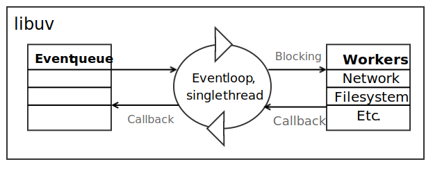

# Fyrirlestur 1.2 — node.js
### Vefforritun 2 — HBV403G
#### Ólafur Sverrir Kjartansson, [osk@hi.is](mailto:osk@hi.is)

---

## Node.js

* Búið til af Ryan Dahl og [fyrst gefið út 2009](http://www.youtube.com/watch?v=ztspvPYybIY)
* Vildi búa til vef sem sýndi framgang meðan skrá var hlaðið upp á vefþjón
* Gerði tilraunir með C, Lua og Haskell en með útgáfu V8 varð JavaScript fyrir valinu

***

## Node.js

* Verkvangur (platform) byggður á V8 til að smíða hröð, skalanleg netforrit
* Notar atburðadrifið, ekki-blokkandi I/O módel sem gerir það létt, skilvirkt og fullkomið fyrir rauntíma forrit sem meðhöndla mikil gögn yfir dreifð kerfi
 Notum til að búa til allskonar forrit, bæði _bakenda_, _CLI_ o.fl.

***

## Node.js

* Ekki forritunarmál, JavaScript er forritunarmálið sem node notar
  - Samleðgaráhrif með framenda, _eitt mál fyrir framenda og bakenda_ getur heillað
  - Samt **ekki** sama keyrsluumhverfið!
* Ekki framework (einsog t.d. Rails eða Django) en getur verið notað til að búa þannig til

***

## V8

* [V8 er Open source JavaScript vél](https://developers.google.com/v8/), hönnuð af Google fyrir Chrome
* Skrifuð í C++ og útfærir stóran part af ECMAScript 6
* Þýðir JavaScript í vélamál fyrir keyrslu í staðinn fyrir að túlka
* Ýmsar bestunar aðferðir keyrðar á þýddan kóða
* Keyrir JavaScript _hratt_

***

## Node.js

* Beislar kraft V8 með því að skrifa lag ofan á það
* Kjarninn í node.js reynir að vera einfaldur
  - Höfum aðgerir fyrir skráarkerfi, networking, stýrikerfi og nokkra aðra hluti
* Mjög gott pakkakerfi, NPM, styður við þetta
  - Flóknari hlutir útfærðir í pökkum

***

## Útgáfur

* Node var lengi vel að keyra á útgáfum 0.x
  - stöðugar útgáfur fyrir jafnar tölur (t.d. 0.10) en óstöðugar fyrir odda tölur (t.d. 0.11)
* Þetta módel var tiltölulega hægt, ný virkni tók langan tíma að komast í stöðuga útgáfu, og vegna þess (ásamt öðrum ástæðum) var [io.js](https://iojs.org) fork af node.js gerður í desember 2014
  - io.js mergað aftur inn í node í maí 2015
* Núverandi stöðuga útgáfa er 8.9.x, útgáfa 9.4.x er með nýjustu virkni

***

## node og ECMAScript 6

* Nýjustu útgáfur af node hafa [99% stuðning við ECMASCript 6](http://node.green/)
* Getum því notað allt nýja dótið án þess að _transpilea_ á _server_
* Fyrir enn nýrri virkni (ECMAScript 2016+) getum við þó sett upp Babel (eða álíka) og _transpileað_

***

## Uppsetning

* Auðvelt að setja upp, stuðningur við Linux, Mac og Windows
  - http://nodejs.org/download
* NPM fylgir með

***

## Margar útgáfur af node í einu

* Útgáfur af node koma frekar ört út
* Getum keyrt margar útgáfur í einu með tólum
* [nvm](https://github.com/creationix/nvm) (mac og linux) eða [nvm-windows](https://github.com/coreybutler/nvm-windows)
  - node version manager

***

## node útgáfa og package.json

* Getum tilgreint hvaða útgáfur af node við skrifum forritin okkar fyrir í `package.json`
* [`"engines"`](https://docs.npmjs.com/files/package.json#engines) lykill er hlutur með lyklum, t.d. `node` og streng sem skilgreinir útgáfu, t.d. `>=8 <10`
  - `"engines": { "node": ">=8 <10" }`
  - node útgáfur 8 og 9, ekki 10

***

## Node binary og REPL

* Þegar við höfum sett upp Node fáum við aðgang að `node` í skel
  - Keyrum forritin okkar með `node forrit.js`
* Ef við keyrum án þess að vísa í skjal fáum við aðgang að REPL
  – Read-Eval-Print Loop
  - Skel fyrir Node.js sem getur verið mjög hjálpleg í að prófa okkur áfram eða debugga kóða
* Hættum í REPL, eða stöðvum keyrslu á forriti með `CTRL+C` sem sendir `SIGINT` á keyrslu

***

## REPL dæmi

```
$ node
> foo = 1
1
> _ + 2     (_ seinasta skilagildi)
3
> .help
```

***

## Atburðadrifið

* Node.js forrit eiga að vera atburðadrifin – erfitt að skrifa þau ekki þannig
* Gefum upp _callback_ fall fyrir hluti sem taka tíma, kallað í það þegar aðgerð klárast
* Allar aðgerðir í core sem gera eitthvað í lengri tíma taka við callback

***

## Atburðadrifið

* Node.js er sjálfgefið keyrt í __einum process__, þar sem CPU er yfirleitt ekki það sem takmarkar
  - Notum ekki þræði fyrir okkar kóða, þó þeir séu notaðir innan node
  - Notum event loop sem heldur utan um allt sem gera þarf
* Þ.a. ef við blokkum—bíðum eftir I/O, minni, neti o.sfr.—þá blokkar allt node.js keyrsluumhverfið
* Svo lengi sem eitthvað er á event loop, keyrir node, annars hættir forrit

***

## libuv

* Í fyrstu var node.js skrifað með libev sem útfærir event loopu, en það er aðeins fyrir Unix
* [libuv](http://docs.libuv.org/) er útfærsla sem keyrir á mörgum stýrikerfum og fókusar á asynchronous (ósamfasa) I/O
* Node.js gar þar með keyrt á Windows
* Orðið nokkuð þroskað verkefni og notað af fleirum í dag

***



***

## Forrit sem keyrir endalaust

```
setInterval(() => console.log('hæ'), 1000);
```

***

## Blokk

```
setTimeout(() => {
  console.log('Finished@' + new Date().toTimeString());
}, 1000);

const s = new Date();
console.log('Start@' + s.toTimeString());

let i = 0;
const iterateForInMs = 10;
while(new Date().getTime() < s.getTime() + iterateForInMs) {
   i++;
}
console.log('Exit@' + new Date().toTimeString());
console.log(i + ' iterations.');
```

http://book.mixu.net/node/ch2.html

---

## console

* Höfum `console` alltaf aðgengilegt líkt og í vafra til að skrifa í `stdout` og `stderr`
* `console.log()` - skrifar í `stdout` með newline
* `console.error()` - eins, en skrifar í `stderror`
* `console.time(label)` - byrjar timer undir `label`
* `console.timeEnd(label)` - endar timer og skrifar hve lengi virkur

***

```
console.log('halló heimur');
console.error('villa!');
```

```
> node log.js > output.txt 2> error.txt
```

***

## Global breytan process

* Í vafra höfum við `window`
* Í Node.js höfum við [`process`](https://nodejs.org/api/process.html)
* Gefur okkur aðgang að upplýsingum um umhverfi og föllum tengdum því

***

## process dæmi

* [`process.exit([code])`](https://nodejs.org/api/process.html#process_process_exit_code) hættir keyrslu forrits með [gefnum kóða](https://en.wikipedia.org/wiki/Exit_status), `0` þýðir að forrit keyrði án villu, stærri en `0` að villa hafi komið upp
* [`process.argv`](https://nodejs.org/api/process.html#process_process_argv) gefur upplýsingum um hvernig kallað var á forrit og öll arguments sem send voru
* [`process.hrtime()`](https://nodejs.org/api/process.html#process_process_hrtime_time) gefur aðgang að háskerpu klukku (nanósek) sem við getum notað til að taka tíma á forritum

***

## hrtime

```
const time = process.hrtime();
setTimeout(() => {
  const diff = process.hrtime(time);
  const elapsed = diff[0] * 1e9 + diff[1];

  console.log(`Took ${elapsed} nanoseconds`);
  console.log(`Took ${elapsed/1e6} milliseconds`);
  console.log(`Took ${elapsed/1e9} seconds`);
}, 1000);
```

***

## Debugger

* Getur verið erfitt að debugga event drifin kóða, svipað og í vafra
* Getum notað V8 debugging með því að setja `debugger;` í kóða
* Keyrum með `node debug` og fáum þá gdb-líkt viðmót til að debugga
* Auðvelt að keyra debugger í [Visual Studio Code](https://code.visualstudio.com/)

***

## Buffer

* JavaScript hefur ekki góða leið til að vinna með binary gögn
* [`Buffer`](https://nodejs.org/api/buffer.html) er global gildi sem við getum notað til að vinna með hrá gögn sem geymd eru utan V8 heap
* Þegar við breytum milli Buffer og JavaScript string, þurfum við að tilgreina enkóðun, t.d. `ascii`, `utf8`, `latin1`
  - `buffer.toString('utf8');`

***

## util

* Ýmis hjálparföll í boði í `util` module
* [`util.format()`](https://nodejs.org/api/util.html#util_util_format_format_args) - `printf`-leg strengja meðhöndlun
* [`util.inherits(constructor, superContstructor)`](https://nodejs.org/api/util.html#util_util_inherits_constructor_superconstructor) - erfir prótótýpu frá super í nýjan hlut en ættum samt frekar að nota ES6 `class`
* [`util.promisify()`](https://nodejs.org/api/util.html#util_util_promisify_original) – nýtt í útgáfu 8, breytir callback API í promise API

***

## Filesystem

* Node.js getur talað við skráarkerfið og gert það sem við búumst við með [`fs`](https://nodejs.org/api/fs.html) module
  - Lesa skrár í möppu, lesa skrár, búa til skrár, vista skrár o.fl.
  - Skilar gögnum í `Buffer`
* `fs.readFile(file, encoding, callback)` les skrá
* `fs.writeFile(file, data, callback)` skrifar skrá

***

## Ekki-blokkandi I/O – Async I/O

* I/O er ótrúlega hægt m.v. annað sem við gerum
* Þegar við biðjum um I/O í node.js sendum við atburði sem verða keyrðir þegar stýrikerfi er búið
* Þurfum því ekki að bíða! Gerum eitthvað nytsamlegt á meðan

***

## Async I/O - dæmi

```
const fs = require('fs');

fs.readFile('data.txt', (err, data) => {
  if (err) {
    console.error('error', err);
  } else {
    console.log(data);
  }
});
```

***

## Callbacks

* Lang flest API í node.js taka við callbacks á forminu
  - `function (err, data) { }`
* Ef villa kom upp er `err` `truthy` og inniheldur upplýsingar um villu
* Annars eru niðurstöður í `data`
* Nýtum okkur fyrir ósamfasa (async) aðgerðir—event loop tekur við beiðni um aðgerð, sér um bókhald og þegar búið, kallar í callback
* Þurfum að hugsa _ólínulega_ um flæðið í forritunum okkar

***

## Línulegt flæði

```
let num = 1;
function addOne() { num++; }
addOne();
console.log(num);
```

***

## Línulegt flæði – bilað

```
const fs = require('fs');
let num;

function addOne() {
  // number.txt inniheldur "1"
  fs.readFile('number.txt', (err, fileContents) => {
    num = parseInt(fileContents, 10);
  });
}

addOne();

console.log(num);
```

***

## Callback flæði

```
const fs = require('fs');
let num;

function addOne(callback) {
  fs.readFile('number.txt', 'utf8', (err, fileContents) => {
    num = parseInt(fileContents, 10);
    num = num + 1;
    callback(num);
  });
}

addOne(num => {
  console.log(num)
});
```

***

## [_Callback hell_](http://callbackhell.com/)

* Ef við framkvæmum margar async aðgerðir hverja á eftir annari, förum við að dragast óþarflega langt til hægri
* Getum forðast með því að:
  - nota ekki nafnlaus föll í callbacks
  - halda kóðanum grunnum
  - skipta kóða upp í módúla
  - nota _promises_
  - nota _async_ og _await_

http://callbackhell.com/

***

## Promises

* node hefur stuðning við promises sem gerir það auðveldara að vinna með async kóða
* Frá og með útgáfu 8 getum við notað `util.promisify` til að breyta callback API í promise API
  - 😍

***

## util.promisify

```
const util = require('util');
const fs = require('fs');

const readFileAsync = util.promisify(fs.readFile);

readFileAsync('data.txt')
  .then(data => {
    console.log(data.toString('utf8'));
  })
  .catch(err => {
    console.error(err);
  });
```

***

## async og await

* Frá og með útgáfu 7.6 hefur node stutt `async` og `await`
* Enn önnur leið til að vinna með async kóða, kemur frá C#
* Notum `await` til að bíða eftir promises í föllum og merkjum þau föll með `async`

***

## async og await

* Kóðinn okkar verður töluvert grynnri og læsilegri
* Notum `try catch` fyrir villumeðhöndlun
* `async` föll skila promises! Þurfum að grípa yst, annars getum við misst af villum

***

```
const util = require('util');
const fs = require('fs');

const readFileAsync = util.promisify(fs.readFile);

async function main() {
  let data = '';
  try {
    data = await readFileAsync('data.txt');
  } catch (e) {
    console.error('error', e);
  }
  console.log(data.toString('utf8'));
}

main().catch(err => { console.error(err); });
```

---

## NPM

* Heeeellingur til af NPM módúlum/pökkum sem geta einfaldað okkur lífið
* Sækjum með `npm install <module> --save` og tilgreinum þannig að forritið okkar þarfnist þessa pakka
  - Skilgreinum _dependency_ á pakkann
  - Vistað í `package.json` ásamt útgáfunúmeri

***

## NPM pakkar


http://www.modulecounts.com/

***

## npm install <module>

* Athugar NPM hver er nýjasta útgáfa af `<module>`
* Sækir útgáfuna
* Skilgreinir útgáfu númer í `package.json`
* Sækir alla pakka sem `<module>` þarf (og pakka sem þeir pakka þurfa o.s.fr.)
* Geymir alla pakka eins útflatta og hægt er í `/node_modules`
* Útbýr `package-lock.json` með upplýsingum um alla pakka

***


***

## Útgáfunúmer

* NPM notar [_semantic versioning_](https://semver.org/) (semver) til að tilgreina útgáfunúmer `major.minor.patch`, t.d. `1.2.3`
  - `major` er hækkað ef við gerum breytingar sem brjóta API, t.d. breytum nafni á falli
  - `minor` er hækkað ef við bætum við virkni án þess að brjóta (backwards compatible)
  - `patch` er hækkað ef við lögum villur án þess að brjóta (backwards compatible)

***

## Hvaða útgáfu má NPM installa?

* NPM tilgreinir útgáfunúmer með _caret_ fyrir framan, t.d. `^1.2.3`
  - Sættum okkur við útgáfur sem hækka ekki fyrsta ekki-0 tölustaf lengst til vinstri, t.d. `^1.2.3` leyfir útgáfu `1.9.3` en ekki `2.0.0`
* Getum líka tilgreint _nákvæma_ útgáfu með `1.2.3`
* og fleiri flóknari reglur, sjá [the semantic versionar for npm](https://docs.npmjs.com/misc/semver)

***

## Hættur þess að leyfa uppfærslur

* Hugbúnaður er (ennþá!) skrifaður af fólki og fólk gerir mistök
* Að leyfa uppfærslur þegar NPM sækir pakka _getur brotið forritin okkar_, þó það sé _bara_ minor útgáfa
* Góð regla að skilgreina nákvæmar útgáfur og uppfæra meðvitað

***

## package-lock.json

* `package-lock.json` skilgreinir nákvæmar útgáfur af öllum pökkum sem við notum og pökkum sem þeir pakkar nota
* Leyfir öðrum að fá _nákvæmlega_ sömu útgáfu af keyrslu umhverfi og sá sem skrifaði
* Geymum því í source control

***

## NPM ókostir?

* En hefur NPM ókosti?
* Seinustu ár hafa komið upp atvik þar sem pakkar hafa horfið úr NPM og haft áhrif á _þúsundir_ verkefna
* Getur verið varasamt að taka á sig of mörg dependancy

***

## Umræður í næsta tíma

Hverjir eru kostir og gallar NPM?

* [The Node.js Community Is Quietly Changing the Face of Open Source](http://caines.ca/blog/2013/04/13/the-node-dot-js-community-is-quietly-changing-the-face-of-open-source/) – frá 2013
* [Rage-quit: Coder unpublished 17 lines of JavaScript and “broke the Internet”](https://arstechnica.com/information-technology/2016/03/rage-quit-coder-unpublished-17-lines-of-javascript-and-broke-the-internet/)
* [NPM & left-pad: Have We Forgotten How To Program?](http://www.haneycodes.net/npm-left-pad-have-we-forgotten-how-to-program/)
* [Code dependencies are the devil.](https://medium.freecodecamp.org/code-dependencies-are-the-devil-35ed28b556d)
* [I’m harvesting credit card numbers and passwords from your site. Here’s how.](https://hackernoon.com/im-harvesting-credit-card-numbers-and-passwords-from-your-site-here-s-how-9a8cb347c5b5)
