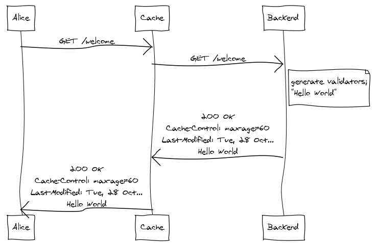
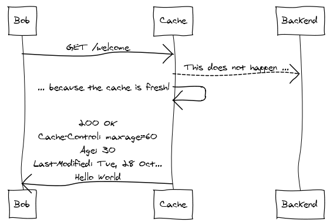
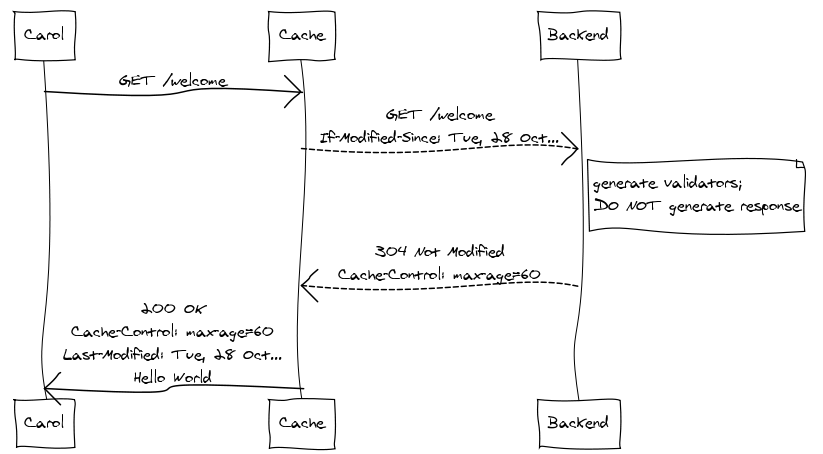

# Fyrirlestur 7.1 — Vefþjónustur #2
### Vefforritun 2 — HBV403G
#### Ólafur Sverrir Kjartansson, [osk@hi.is](mailto:osk@hi.is)

---

## Aðeins um id

* `id` einsog við notum þau í gagnagrunnnm eiga að vera einstök
* Látum gagnagrunn sjá um það fyrir okkur
  - `id serial primary key`
* Alveg eðlilegt að það myndist „göt“ ef við eyðum færslum
  - t.d. færslur eru með id `3, 6, 7, 9, 12`

***

## Aðeins um eslint

* eslint hjálpar okkur með tvennt:
  - Samræma stíl og ýta undir „best practices“
  - Gera færri klaufavillur
* Ef eitthvað er ekki að virka einsog við höldum að það ætti að gera, keyrum eslint
* Afskaplega nytsamlegt að hafa uppsett í textraritli

---

## Efnissamningaviðræður – content negotiation

* `Accept` hausar eru notaðir til að skilgreina hvaða efni client þekkir og hversu vel með q gildi frá 0 til 1
* Server ákveður hvaða efni hann sendir til baka, t.d.
  - `Accept-Language: de; q=1.0, en; q=0.5` – „ég skil þýsku best en svo ensku“
  - `Accept: text/html; q=1.0, text/*; q=0.8, image/gif; q=0.6, image/jpeg; q=0.6, image/*; q=0.5, */*; q=0.1`

***

## Útgáfustýring á API

* Þegar við gefum út hugbúnað og einhver fer að nota hann þurfum við að hugsa um þá notendur
* Geta ekki allir uppfært þegar við viljum, gætum þurft að styðja fleiri en eina útgáfu í einu
* T.d. höfum API fyrir appið okkar, ári seinna gefum við út nýja útgáfu en í einhvern tíma (jafnvel langan) munum við enn hafa notendur á gamla appi

***

## Útgáfustýring API – header

* Getum notað `Content-Type` og `Accept` header til að tilgreina _hvaða_ útgáfu af API við viljum
* Gefum út útgáfu `1.0`
  - `application/json;vnd.example.foo.json+v1`
  - `vnd` stendur fyrir vendur – gefið út af einkaaðila

***

## Útgáfustýring API – header

* Næsta útgáfa breytir gögnum á einhvern hátt
  - `application/json;vnd.example.foo.json+v2`
* Client biður um hvaða útgáfu sem er
  - `Accept: */*`

***

## Útgáfustýring API – header

* Sem við svörum með nýjustu útgáfu:
  - `Content-Type: application/json;vnd.example.foo.json+v2`
* Beðið um nákvæmlega útgáfu 1
  - `Accept: application/json;vnd.example.foo.json+v1`

***

## Content negotiation og Express

[`res.format`](http://expressjs.com/en/4x/api.html#res.format) leyfir okkur að stýra hvernig við svörum content negotiation

```javascript
res.format({
  'application/vnd.example.foo.v1+json': () => {
    return res.status(200).json({ version: 1 });
  },
  'application/vnd.example.foo.v2+json': () => {
    return res.status(200).json({ version: 2 });
  },
  'default': function() {
    return res.status(415).json({ error: 'Unsupported Media Type' });
  }
});
```

***

## Útgáfustýring API – URI

* E.t.v. einfaldari leið til að útgáfustýra er að setja útgáfunúmer í URI
  - `/v1/foo`
  - `/v2/foobar`

```javascript
app.use('/v1', apiv1);
app.use('/v2', apiv2);
```

---

## Paging

* Þegar við erum að vinna með mikið af gögnum þurfum við oft á tíðum að takmarka hversu miklu er skilað
* Ekki vænlegt að skila öllum _miljón_ færslum til notanda
* Yfirleitt útfært með því að skila _síðum_

***

## Síður

* Síður takmarkast af fjölda færsla per síðu (`limit`) og hve mörgum við sleppum (`offset`)
  - `limit = 10, offset = 10` birtir færslur 11-20
* Einnig hægt að einfalda í `page`, höfum þá skilgreindan fjölda per síðu og `page` er margföldun á honum
  - `page = 1` eru færslur 1-10, `page = 4` eru færslur 31-40

***

## Upplýsingar um síðu

* Getum skilað upplýsingum um síðu í svari eða header
* [RFC 5988](https://tools.ietf.org/html/rfc5988) skilgreinir _web linking_ og hvernig nota megi í hausum
  - `Link: <http://api.example.com/?page=1>; rel="previous", <http://api.example.com/?page=3>; rel="next", `
* Getur verið einfaldara að skila í svari, hægt að nota `_link` sem er skilgreint í [HAL](https://en.wikipedia.org/wiki/Hypertext_Application_Language)

***

```json
{
  "_links": {
    "self": {
      "href": "http://api.example.com/?page=2"
    },
    "previous": {
      "href": "http://api.example.com/?page=1"
    },
    "next": {
      "href": "http://api.example.com/?page=3"
    }
  },
  "items": []
}
```

---

## Leit

* Með stórum gagnasettum fylgir of einnig þörf til að geta leitað í þeim
* Nokkrar leiðir mögulegar

***

## Table scan

* Fyrsta lausn sem manni gæti dottið í hug væri að nota `LIKE` leit í gagnagrunni
* Veljum dálka til að leita í og setjum leitarskilyrði inn með `%`
  - `... WHERE description LIKE '%foo%'`
* Afskaplega slæm lausn þar sem fyrir hvert skilyrði þarf að skoða alla dálka í töflu
  - [Allt er hratt fyrir lítið `n`](https://blog.codinghorror.com/everything-is-fast-for-small-n/)

***


***

## Index

* Getum þá útbúið _index_ fyrir töflu, veljum einhverja dálka og geymum þá sérstaklega
* Til sérstök lausn á þessu með _full-text index_, allur texti settur í index og leitað sérstaklega í honum
  - Getur þurft sérstaka uppsetningu í gagnagrunni

***

## Leitarþjónusta

* Önnur algeng lausn er algjörlega aðskilinn leitarþjónusta
* Tengjum gögnin í okkar gagnagrunn við leitarþjónustu, t.d. með reglulegum keyrslum eða _triggers_
* Bíður upp á sérhæfða leit með setningarfræði og álíka
* T.d. elasticsearch eða algolia

---

## Caching

Þrjár leiðir til að cache-a gögn í HTTP:

* Ferskleiki – gefinn tími sem gögn eru „fersk“ og ekki þarf að sækja aftur á vefþjón, t.d. með `Cache-Control: max-age=n` haus
* Staðfesting – getum fengið staðfestingu hvort gögn séu enn í lagi
  - t.d. með `If-Last-Modified` haus og `ETag` haus
* Ógilding – ef við breytum gögnum (`POST, PUT, DELETE`) þá er cache hreinsað

***

## Caching

Hverjir og hvar cachea?

* Vafrar – Til að bæta upplifun eru hlutir sem má geyma, geymdir í vafra cache
* Proxy cache – Svipað og í vöfrum, nema á stærri skala, t.d. hjá fyrirtæki eða ISP
* Gateway cache (eða reverse proxy cache) – Yfirleitt sett upp fyrir framan bakenda til að draga úr þörf á að sækja sama efnið oft

***



***



***



***

## CDN

* Content Delivery Network
* Sér um að dreifa efni um heiminn og gera aðgengilegra hraðar
* Cache'ar efni á endanóðum og notar allskonar trikk til að auka hraða

***


***

## Forrit sem cachea

* Getum útbúið okkar eigin cache fyrir ýmislegt í forritunum okkar
  - Cache á gildi sem tekur langan tíma að reikna (t.d. úr gagnagrunni)
  - Cache á síðu sem er lengi að vera búin til (t.d. mörg dýr köll í gagnagrunn)
  - Cache á gögnum frá API
  - o.s.fr.

***

## Cache

* Eitt það flóknasta við cache er hve lengi þau eigi að geyma upplýsingar og hvernig við hreinsum þau
* Geta aukið hraða gífurlega en á kostnað þess að sýna gömul gögn
  - Notendur skilja ekki alltaf
* Í einhverjum tilfellum getur cache haldið vef í loftinu ef bakendi fer niður

***

> “There are only two hard things in Computer Science: cache invalidation and naming things.”
– [Phil Karlton](http://martinfowler.com/bliki/TwoHardThings.html)
