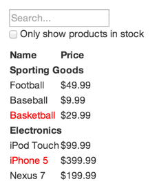

# Fyrirlestur 9.1

## React #3

### Vefforritun 2 — HBV403G

#### Ólafur Sverrir Kjartansson, [osk@hi.is](mailto:osk@hi.is)

---

## Staða í stærri forritum

* Stærri forrit þurfa yfirleitt að deila stöðu á milli hluta
  - Er notandi innskráður? Er búið að sækja gögn?
* Ein leið er að „lyfta stöðu“ upp tréð og láta sameiginlegt foreldri sjá um stöðu fyrir systkini

***

* Sendum föll á milli sem börn kalla í til að uppfæra stöðu foreldris sem síðan sendir sem prop til annara
  - Getum samt lent í vandræðum, hvar hættum við? Vita allir af öllu?
* Hugtakið um „single source of truth“ er mikilvægt í react
  - Þurfum e.t.v. að skrifa meiri kóða en fáum færri bögga á móti

***

## Dæmi

[React Docs: Lifting State Up](https://reactjs.org/docs/lifting-state-up.html)

---

## Composition og inheritance

* Í react notum við composition í staðinn fyrir inheritance
* Eina sem við `extend`um er `Component` eða `PureComponent`
  - Búum **aldrei** til okkar eigin yfir klasa og gerum `extends MyComponent`

***

## Containment

* Sum component vita ekki hvað þau munu innihalda
* Sérstaklega generísk component fyrir „box“
* Þau ættu að nota `children` til að skrifa út börn

***

```javascript
function FancyBorder(props) {
  return (
    <div className={'FancyBorder FancyBorder-' + props.color}>
      {props.children}
    </div>
  );
}
```

```javascript
function WelcomeDialog() {
  return (
    <FancyBorder color="blue">
      <h1 className="Dialog-title">Welcome</h1>
      <p className="Dialog-message">
        Thank you for visiting our spacecraft!
      </p>
    </FancyBorder>
  );
}
```

***

## Sérhæfing

* Ef við viljum endurnýta getum við notað sérhæfingu
* Útbúum almennan component
* Útbúum sérhæfð tilvik

***

```javascript
function Dialog(props) {
  return (
    <FancyBorder color="blue">
      <h1 className="Dialog-title">
        {props.title}
      </h1>
      <p className="Dialog-message">
        {props.message}
      </p>
    </FancyBorder>
  );
}
```

***

```javascript
function WelcomeDialog() {
  return (
    <Dialog
      title="Welcome"
      message="Thank you for visiting our spacecraft!"
    />
  );
}
```

***

> At Facebook, we use React in thousands of components, and we haven’t found any use cases where we would recommend creating component inheritance hierarchies.

> – [React docs](https://reactjs.org/docs/composition-vs-inheritance.html)

***

> Favor object composition over class inheritance.

> – [GoF: “Design Patterns”](https://en.wikipedia.org/wiki/Composition_over_inheritance)

---

## Að hugsa í react

* Að temja sér að smíða forrit í react tekur smá tíma
  - One-way binding og state helst
* [Thinking in React](https://reactjs.org/docs/thinking-in-react.html) í skjölun fer í gegnum hugsanaferli sem getur hjálpað
* Æfing, æfing, æfing...

***

1. Break The UI Into A Component Hierarchy
2. Build A Static Version in React
3. Identify The Minimal (but complete) Representation Of UI State
4. Identify Where Your State Should Live
5. Add Inverse Data Flow

***




---

## DOM

* Stundum þurfum við að gera eitthvað fyrir utan react, nota _imperative_ API
  - t.d. kalla í `open()` eða `close()` í staðinn fyrir að geta sent `isOpen={true}`
* Getum þurft ef við erum að sjá sjálf um fókus (`focus` og `blur`), spila vídeo, keyra kvikun o.fr.

***

## Ref

* `ref` er leið til að fá DOM nóðu fyrir react element
* Sendum inn callback sem keyrir þegar nóða er `mounted`, setjum yfirleitt nóðu á klasa með `this`
  - `<input ref={(input) => { this.input = input; }} />`

***

* Virkar ekki fyrir functional componenta
* Ef við erum að nota `ref` mikið gæti verið að við séum ekki að skrifa componenta eftir _react leiðinni_

***

```javascript
class CustomTextInput extends Component {
  focusTextInput = () => {
    this.input.focus();
  }
  render() {
    return (
      <div>
        <input
          type="text"
          ref={(input) => { this.input = input; }} />
        <button onClick={this.focusTextInput}>
          focus
        </button>
      </div>
    );
  }
}
```

***

## dangerouslySetInnerHTML

* Ef við þurfum að setja _hrátt_ HTML inn er react ekki hrifið af því
* Minnir okkur á að það er hættulegt vegna XSS með því að endurnefna `innerHTML` í `dangerouslySetInnerHTML` og gera erfitt
* `<div dangerouslySetInnerHTML={{__html: 'First &middot; Second'}} />;`

***

## Uncontrolled components

* Ef við stýrum ekki gildi forma með react höfum við _uncontrolled component_
* Notum `ref` til að nálgast gildið úr DOM
* Ef við viljum setja gildi í byrjun sem ekki er yfirskrifað notum við `defaultValue`
* `<input type="file">` er alltaf _uncontrolled_

***

```javascript
handleSubmit = (e) => {
  e.preventDefault();
  alert('Name: ' + this.input.value);
}

render() {
  return (
    <form onSubmit={this.handleSubmit}>
      <input
        defaultValue="Bob"
        type="text"
        ref={(input) => this.input = input} />
      <button>Submit</button>
    </form>
  );
}
```

***

```javascript
class FileInput extends React.Component {
  handleSubmit = (event) => {
    event.preventDefault();
    alert(`File = ${this.fileInput.files[0].name}`);
  }
  render() {
    return (
      <form onSubmit={this.handleSubmit}>
        File:
        <input
          type="file"
          ref={input => {
              this.fileInput = input;
            }}
          />
        <button type="submit">Submit</button>
      </form>
    );
  }
}
```

---

## Higher-Order Components

* [Higher-Order Components](https://reactjs.org/docs/higher-order-components.html) (HOC) eru leið til að endurnýta lógík
  - Eins og higher-order functions
* Fall sem tekur inn component og skilar component
* HOC breytir ekki component eða notar erfðir, heldur er component wrappaður og fær auka gögn með `props`

***

* Oft notað af pökkum til að ljá okkar componenta auka virkni
  - Oftast nefndir `with*` og fara utanum componentinn okkar, `withRouter(Navigation)`
  - Stundum föll sem skila HOC, `connect(options)(Navigation)`

***

* Getum notað sjálf til að minnka endurtekningu og endurnýta lógík
  - Ekki ráðlagt að grípa strax til HOC og við sjáum möguleika, þeir geta aukið flækjustig
* [Nokkrir aðrir hlutir sem þarf að hafa í huga](https://reactjs.org/docs/higher-order-components.html#caveats)
  - T.d. að senda áfram `props` með spread operator: `...props`

***

```javascript
function logProps(WrappedComponent) {
  return class extends React.Component {
    componentWillReceiveProps(nextProps) {
      console.log('Current props: ', this.props);
      console.log('Next props: ', nextProps);
    }
    render() {
      return <WrappedComponent {...this.props} />;
    }
  }
}
```

---

## Render props

* [Render props](https://reactjs.org/docs/render-props.html) eru önnur leið til endurnýtingar
* Nýrri—og að vissu leiti—einfaldari leið til að ná fram því sama og HOCs
* Render prop er `prop` sem component notar til þess að rendera, þarf ekki að heita `render`
  - Sumir nota `children`

***

```javascript
render() {
  return this.props.render(this.state);
}
```

```javascript
<DataProvider render={data => (
  <h1>Hello {data.target}</h1>
)}/>
```

---

## Container components

* React pattern sem snýr að því að aðskilja það að sækja gögn frá því að birta gögn
* Eykur möguleika á endurnýtingu birtingar hluta
* Hreinlegra, sérstaklega þegar hlutirnar fara að flækjast
* [Container Components](https://medium.com/@learnreact/container-components-c0e67432e005)
* [Presentational and Container Components](https://medium.com/@dan_abramov/smart-and-dumb-components-7ca2f9a7c7d0)

---

## Acessibility

* Auðvelt að gleyma aðgengi þegar við byggjum react vefi
* Sömu prinsipp, tól og tækni gilda og áður
* Nokkur atriði sem þarf sérstaklega að huga að, farið yfir í skjölun:
  - [React docs: Accessibility](https://reactjs.org/docs/accessibility.html)

---

## CSS

* Þar sem við einangrum virkni í componentum minnkar þörf á að nota sérstök tól eins og Sass
* Geymum component í möppu og höfum CSS skrá í sömu möppu
* Vísum í CSS á einhvern hátt og tengjum þannig við component
  - Í CRA: `import './Component.css';`

***

* Að nota BEM eða álíka hjálpar okkur við að yfirskrifa ekki stíla frá öðrum componentum
* [React Transition Group](https://reactcommunity.org/react-transition-group/) og [CSSTransition](React Transition Group) útfæra kvikun með componentum

***

## Sérhæfing á stílum

* Ef við höfum `<Button>` component sem hefur sýna eigin grunnstíla getum við þurft að sérhæfa útlit
  - T.d. í formi þurfum við að færa hann aðeins niður eða til hliðar
* `<Button>` hefur sitt eigið `className` en tekur við öðrum í gegnum `prop`, bæði eru síðan notuð

***

```javascript
import './Button.css';
export default class Books extends Component {
  render() {
    const { children, className } = this.props;

    const classes = `button ${className}`;

    return (
      <button className={classes}>{children}</button>
    );
  }
}
```

***

```javascript
const form = (
  <form>
    <Button className="form__button">takki</Button>
  </form>
);
```

```html
<form>
  <button class="button form__button">takki</button>
</form>
```

---

## Uppbygging á verkefnum

* Gott skipulag á verkefni skiptir máli eftir því sem það stækkar
* Oftast heitir mappan sem inniheldur react verkefni `src/`
  - Utan hennar liggja lýsigögn fyrir verkefni, t.d. `package.json`, config skrár o.þ.h.
* Reglulega getur verið gott að fara yfir og hreinsa til og hugsanlega endurskipuleggja

***

## src/

* Innan `src/` skiptum við verkefni en frekar niður eftir þörfum
* Í rót ætti að vera sem minnst, einhver inngangspunktur inní forrit í `index.js` og hugsanlega `App.js`
* Einnig grunnstílar
  - `index.css` skilgreinir grunn, t.d. reset og leturgerðir
  - `App.css` skilgreinir layout

***

* `components/` inniheldur endurnýtanlega componenta
* `routes/` inniheldur routes sem við vísum í með `react-router`, síðurnar okkar
* `utils/`, gæti innihaldið hjálparföll sem oft eru notuð
* `containers/`, ef við notum containera getur verið gott að aðskilja frá components
* `actions/` og `reducers/` ef við erum að nota redux
* o.s.fr. eftir því sem verkefni þarf

***

## Components

* Hver component ætti að eiga heima í eigin möppu
* Mappa inniheldur allt sem component þarf
  - Skilgreining á component
  - Stílar, ef einhverjir
  - Test, ef einhver

***

* Þar sem við notum möppu þurfum við `index.js`
* Ef við skilgreinum component þar getur orðið erfitt að leita að honum í ritli eftir því sem verkefni stækkar
* Getum því nefnt component `Component.js` og importað/exportað í `index.js`

***

```javascript
import Component from './Component';
export default Component;
```

***

```bash
src/
├── App.js
├── App.css
├── index.js
├── index.css
├── components/
│   ├── button/
│   │   ├── index.js
│   │   ├── Button.js
│   │   ├── Button.css
├── routes/
│   ├── home/
│   │   ├── index.js
│   │   ├── Home.js
```

---

## Nánar

* [When Does a Project Need React?](https://css-tricks.com/project-need-react/)
* [Evolving Patterns in React](https://medium.freecodecamp.org/evolving-patterns-in-react-116140e5fe8f)
* [React Design Principles](https://reactjs.org/docs/design-principles.html#)
* [React Fiber Architecture](https://github.com/acdlite/react-fiber-architecture)
* [React - Basic Theoretical Concepts](https://github.com/reactjs/react-basic)
* [Build Your Own React — A Step By Step Guide](https://hackernoon.com/build-your-own-react-48edb8ed350d)

***

## Áhugaverðir pakkar

* [react-motion](https://github.com/chenglou/react-motion)
* [redux](https://redux.js.org/)
* [preact](https://github.com/developit/preact)
* [mobx](https://mobx.js.org/)
